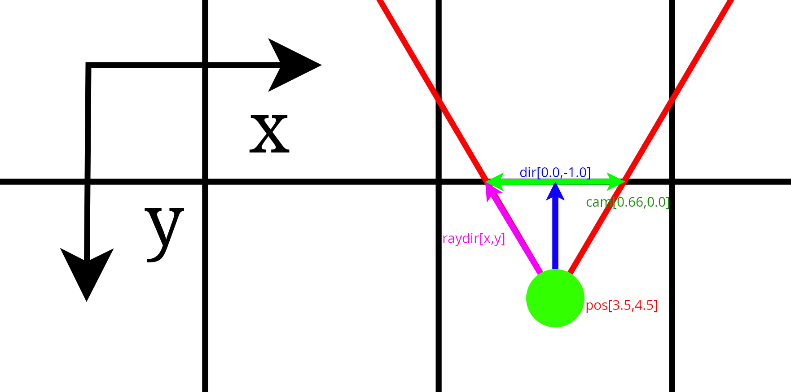
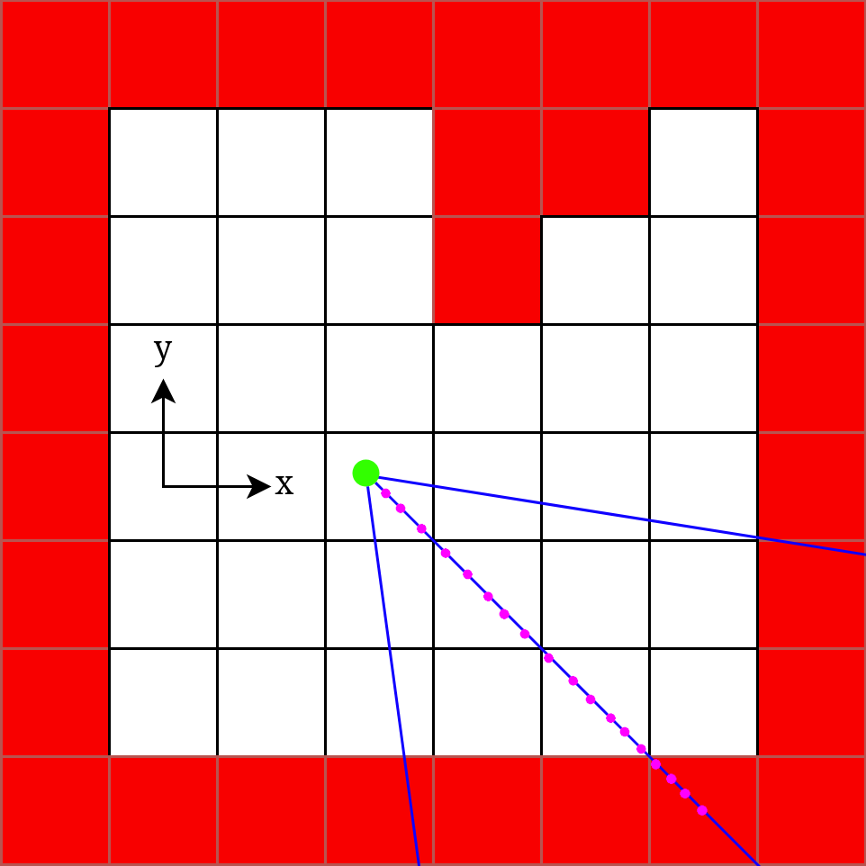
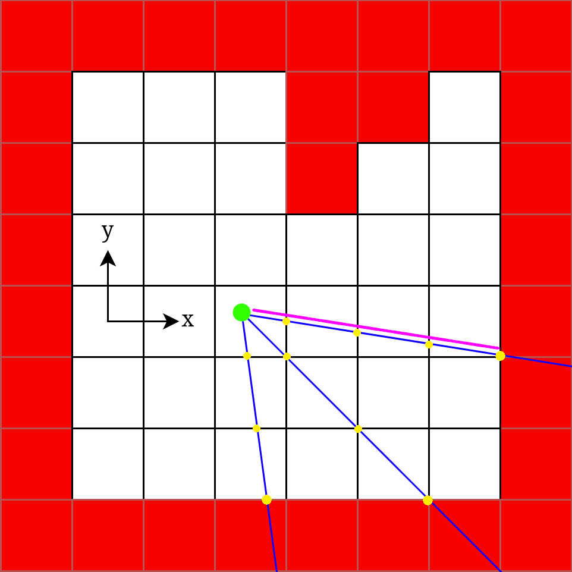
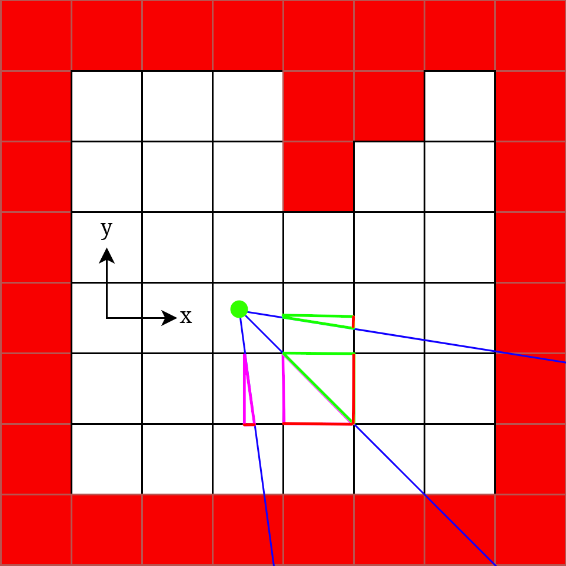
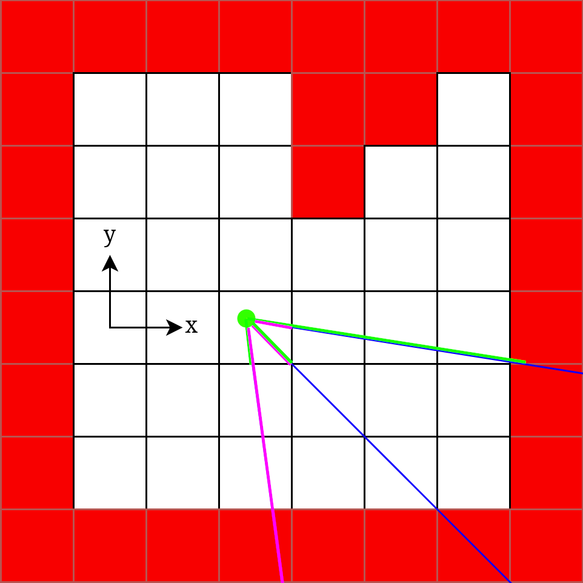
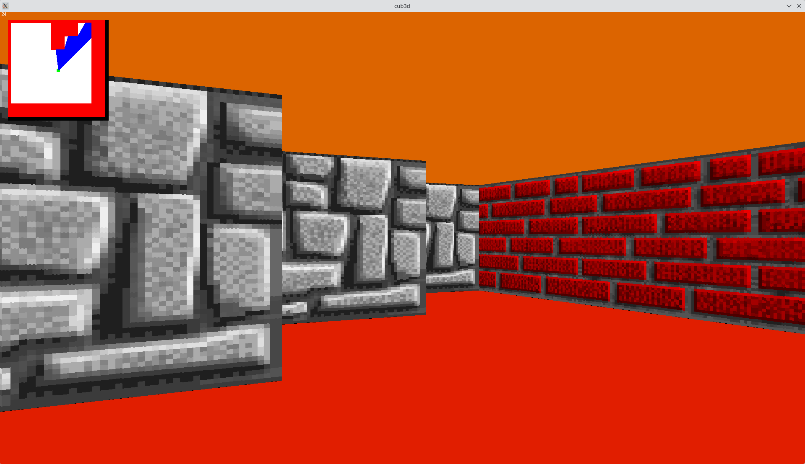

# Raycast

## Basic idea

To transcript a 2d map into a 3d world with a first person point of view\
To do this we cast rays starting from player position and ending on the first wall hit following a straight line\
There are as much ray casted as there are pixels in the window width\
The goal is that for each ray/line casted we expand that line until we hit a wall\
So we can recover the distance to our wall for that column of our screen and with that distance we are able to know how high the wall will appear on our screen&#x20;

<div align="center"><figure><figcaption><p>Simple example, left ray is the first column our screen and the right one the last one. The blue vector represent looking direction of our player [0.0,-1.0]. Green arrows are the representation of the camera plane [0.66,0.0]</p></figcaption></figure></div>

For our Raycast method, we will use a `lookdir` vector which we set at `[0.0, -1.0]` at the start (player look in front). To fake a 3d space from our 2d screen, we will have to use a camera plane vector that will be perpendicular to our looking direction here at the start we set it to `[0.66, 0.0]` dition of those 2 vector will result in the ray direction for our last screen column.\
So for `0 < x < WIDHT` , we will get a scale factor for our camera plane `camera_x` that will range between -1.0 and +1.0. In the image before in purple we can see the `raydir` of the first column of our screen.&#x20;

$$
\mathbf{camera_x}
=

 2 *\frac{x}{\text{WIDHT}} - 1
$$

$$
\mathbf{raydir}
\begin{bmatrix}
x \\
y
\end{bmatrix}
=
\mathbf{lookdir}
\begin{bmatrix}
x \\
y
\end{bmatrix}
+
\mathbf{camera}
\begin{bmatrix}
x \\
y
\end{bmatrix}*\mathbf{camera_x}
$$

<div><figure><figcaption><p>Our goal find the yellows point to<br>get the purple line length</p></figcaption></figure> <figure><figcaption><p>Example of a define step </p></figcaption></figure> <figure><figcaption><p>Example of a define smaller step </p></figcaption></figure></div>

```
// Some code
```

In the last 2 images above, we can see that having a define step and try to see if we hit the wall can work but we won't get the exact length value from player to wall on that line.\
The best way to increase our step and check if we hit a wall is to check only when we cross the y or x axis to do that we will need 4 different values.

<div><figure><figcaption><p>Right steps</p></figcaption></figure> <figure><figcaption><p>Red line are delta_dist for each triangle in purple for y and green for x</p></figcaption></figure> <figure><figcaption><p>In green for y and purple for x</p></figcaption></figure></div>

<div><figure><figcaption><p>Right step</p></figcaption></figure> <figure><figcaption></figcaption></figure></div>

<figure><figcaption></figcaption></figure>


<figure><figcaption></figcaption></figure>


